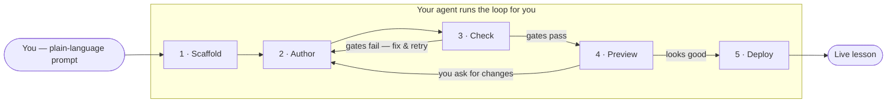
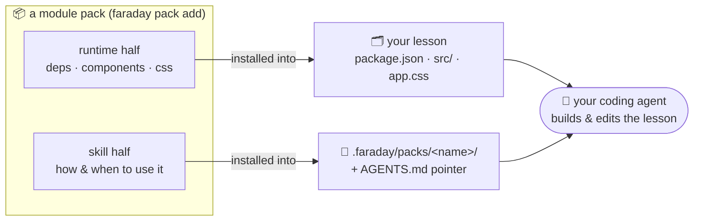

# Faraday Academy

[*한국어*](README.md) · **English**

> **Turn a lesson you already teach into an interactive textbook — with a grounded AI tutor.**
> No terminal required — **two chat messages** to your coding agent.

<!-- 📸 hero.gif — see docs/images/README.md -->


---

## Start here

**You need:** [Cursor](https://cursor.com) · [Claude Code](https://claude.ai/code) · or [Codex](https://openai.com/codex)  
(If you already have an agent, you're ready. You don't need to touch Node/pnpm yourself.)

### 1 · Install the Faraday skill

Paste into your agent chat:

```text
Please install the Faraday skill so you can build interactive lessons for me.
Run: npx skills add ssota-labs/faraday-academy
```

### 2 · Ask for the lesson in plain language

```text
Make an interactive lesson on compound interest.
Let me drag principal, rate, and years — and add a grounded AI tutor.
```

The agent scaffolds → authors → checks → opens a live preview. Then keep chatting:

```text
Open the preview
Add one more quiz
Make the chart bigger
Deploy it
```

### More paste-ready prompts

```text
Make an interactive lesson that teaches binary search, and add a grounded AI tutor.
```

```text
Make a 3D solar-system lesson. Let me control time speed with a slider.
```

```text
Make a Galton board with physics to teach probability. Show the normal distribution build up.
```

More examples → [Example lessons](#example-lessons--the-feel)

<details>
<summary>Per-agent plugin install</summary>

| Agent | Steps |
|---|---|
| **Claude Code** | `/plugin marketplace add ssota-labs/faraday-academy` → `/plugin install faraday@faraday` |
| **Codex** | `codex plugin marketplace add ssota-labs/faraday-academy` |
| **skills (any)** | `npx skills add ssota-labs/faraday-academy` |

See [`plugins/claude-code/`](plugins/claude-code/) and [`plugins/codex/`](plugins/codex/).

</details>

<details>
<summary>Prefer the terminal?</summary>

```bash
npx @faraday-academy/cli@latest new my-lesson
cd my-lesson && pnpm dev
```

The chat path is usually easier — the skill also picks blocks, packs, and quality gates.

</details>

---

## What Faraday is (one line)

A **scaffolder** that turns a plain-language ask into a self-contained Vite + React lesson the reader *manipulates* — optionally with a grounded **AI tutor**, 3D, quizzes, and curriculum worlds.  
For tutors, TAs, teachers, and course authors who already run a coding agent.

Architecture / strategy: [vision](docs/content/docs/vision.mdx) · [GTM](docs/content/docs/planning/gtm.mdx)

---

## Why Faraday

Coding agents made it suddenly easy — and cheap — to *build* things with code, and
educational material is one of the biggest beneficiaries. Yet most of it is still
trapped in **static text**: slides, PDFs, textbooks. The same idea taught as an
**interactive** — a simulation you steer, a quiz that adapts, an animation, a live
graph, a 3D scene, an AI tutor beside the text — lands better, because the learner
*does* the idea instead of reading it.

This isn't a new dream. Flash-era science simulations proved interactive material
works. But it never went mainstream, because **code was expensive** — you needed an
engineer for every lesson. Coding agents remove that cost: an educator can now
describe what they want and get a working interactive.

Early-adopter educators are already trying this. The catch: **quality takes trial
and error.** A raw agent can build *an* interactive, but getting one that actually
teaches well — the right interaction, the right assessment, a coherent look — takes
many iterations.

Faraday front-loads that quality. It ships the **components and modules** good
courseware reuses, plus a **skill** that teaches the agent how to combine them well —
so you convey *intent* and the agent produces high-quality material with far less
trial and error.

And by packaging capabilities as **module packs** — from the surface UI of a lesson
down to the *software of teaching itself* (pedagogy, methodology) — anyone can bottle
their own know-how and share it. The goal is a **community** where a great lesson
format, or a proven teaching method, is one `faraday pack add` away.

---

## The loop

You drive everything by talking to your agent — it runs the tools for you. A
typical lesson moves through five phases:

1. **Scaffold** — the agent creates a fresh lesson app (2D by default; it adds
   3D, physics, or the AI tutor when your request calls for them).
2. **Author** — it writes `src/lesson/lesson.tsx` using the Faraday blocks and
   runtime. This is the creative part, and it's what your prompt shapes.
3. **Check** — it runs the structure + integrity gates and fixes anything that
   trips them.
4. **Preview** — it serves the lesson locally so you can play with it and ask for
   changes.
5. **Deploy** — on request, it builds a static bundle (or a server build for
   tutor lessons) and ships it.



You stay in plain language the whole way — "make the graph bigger," "add a quiz,"
"now deploy it." The **Author → Check → Preview** stretch loops as many times as
it takes; you just keep asking for changes. The [CLI reference](#cli-reference)
below documents the commands the agent runs under the hood, if you're curious.

---

## Two areas (how a lesson is laid out)

Every scaffolded lesson has two areas. Knowing which is which just helps you and
your agent stay oriented — it's all your code, and you (or your agent) can change
any of it.

| Area | Path | What it is |
|---|---|---|
| **Author area** | `src/lesson/**` | Your lesson. `src/lesson/lesson.tsx` is the fixed entry and must `export default` a React component. Add sibling files freely — this is where the work happens. |
| **Runtime area** | `src/faraday/**` | The generated runtime: shadcn UI, lesson blocks, runtime, styles, world/tutor runtimes. Your agent normally authors *against* it rather than *into* it, so upgrades stay clean. A SHA-256 manifest lets `pnpm check` flag when it has changed — a heads-up, not a lock. Edit it if you have a reason to. |

`src/main.tsx`, `index.html`, and config are the app shell; you rarely need to
touch them. Templates already import via the `@/faraday/*` alias, so there's no
import rewriting at scaffold time.

The scaffolded project ships its own authoring guide in `AGENTS.md` and
`docs/authoring.md` — your agent reads those to learn the blocks API.

---

## Components — what a course is made of

A course isn't one thing. Faraday gives your agent a component for each part of
teaching, and you compose them per lesson:

| Preview | Component | What it does | Built from |
|---|---|---|---|
|  | **📚 Curriculum / world** | Order lessons into a linear textbook, or a game-like map with unlock progression you navigate. | `<Course>` · `<CourseHost>` + world packs |
|  | **🎬 Slide view** | Slide-view presentation — one idea per screen, prev/next, animation. | `<SlideDeck>` · `sim2d` pack · `slide-view` pack |
|  | **✅ Quiz / assignment** | Checks that *teach* — MCQ, typed numeric, sketch-to-predict, and missions cleared in the sim. | `<Quiz>` · `<NumericAnswer>` · `<Challenge>` · `<SketchPad>` |
|  | **📊 Student management** | Record progress and show a dashboard across a lesson or a whole course (LMS). | `runtime/lms` (recorder + dashboard) |
|  | **🤖 AI tutor** | A grounded, Socratic chat that answers only from the lesson's own content. | `tutor` pack |

<!-- 📸 component-*.png thumbnails — see docs/images/README.md. Broken icons above are placeholders until you drop the files in. -->

Underneath, each of these is a **module** you can mix. Here's the detail.

## What you can build (the layer stack)

Faraday closes the feature set **horizontally** at Stage 1 — every layer works
today under BYOK / self-deploy. Later stages remove friction (managed AI,
multi-tenancy, payments), they don't add features. (See [vision](docs/content/docs/vision.mdx).)

Each layer is a **module** — a pinned `@faraday-academy/*` package (or a
sub-module inside `runtime`) that your agent composes. The runtime ships ~24
lesson blocks, grouped by what they do:

| Group | Blocks | For |
|---|---|---|
| **Layout & canvas** | `<Lesson>` `<Prose>` `<Stage>` `<Workbench>` `<ControlGroup>` `<SlideDeck>` | Structure the page; `<Workbench>` is the live canvas + floating controls; `<SlideDeck>` is a screen-at-a-time (tablet / slideshow) layout. |
| **Live controls** | `<ParamSlider>` `<ParamSwitch>` `<Segmented>` `<Scrubber>` + `useStepper` `<Readout>` `<Chart>` `<Stat>` | The knobs the reader turns and the numbers / plots that react in real time. |
| **Assessment** | `<Quiz>` `<NumericAnswer>` `<Challenge>` `<SketchPad>` | Recognize (MCQ), compute (typed answer), *do* (a mission you clear in the sim), predict (pen / Apple-Pencil sketch vs. a revealed answer). |
| **Explanation** | `<Derivation>` `<TeX>` `<CodeCell>` `<Reveal>` `<Compare>` `<Callout>` | Formulas derived line-by-line, KaTeX math, a runnable JS cell, progressive reveals and side-by-sides. |

On top of the blocks:

- **3D** (`@faraday-academy/three`, `pack add three`) — `<Scene3D>` (R3F) with procedural
  helpers (`<Body>`, `<Planet>`, `<OrbitPath>`, `<Label3D>`), a `<Model>` glTF
  loader, and a `mood` per scene (`space`, `cell`, `lab`, `physics`, `abstract`).
  **Procedural-first, asset-fallback.**
- **Physics** (`pack add three --physics`) — Rapier gravity/collision via `@react-three/rapier`.
- **Curriculum / world** (`runtime/world`) — bundle many lessons: `<Course>` for
  a linear textbook (chapter nav, prev/next, `#hash`), or `<CourseHost>` with
  **unlock progression** and a swappable **pack** — `linearPack` (status list),
  `map2dPack` (2D node map), or `world3dPack` (3D open-world / RPG). The pack is
  the seam you swap to reskin the whole world.
- **LMS** (`runtime/lms`) — a progress recorder + dashboard that attach to a
  lesson or a whole course.
- **Tutor AI** (`@faraday-academy/tutor`, `pack add tutor`) — a **durable, grounded**
  chat agent embedded beside your content. More below.

---

## Example lessons — the feel

A quick tour of what "one command → an interactive lesson" actually produces.
Each is a real combination of the blocks and flags above; your agent generates
them on demand from a topic — you don't wire any of it by hand.

- **Watch Dijkstra find the shortest path.** Step through a graph as the frontier
  expands, scrubbing back and forth — then ask the built-in tutor *why* it never
  revisits a settled node. *(stepped frames + `<Scrubber>` + `tutor` pack)*
- **Feel compound interest compound.** Drag principal, rate, and compounding
  frequency; the balance curve and the final number update live. The "Rule of 72"
  stops being a formula you memorize. *(live knobs + `<Chart>` + `<Stat>`)*
- **See Kepler's second law sweep equal areas.** A planet on a real elliptical
  orbit in 3D speeds up near the sun; drag the eccentricity and the equal-area
  sweeps stay equal. *(3D, `space` mood — `three` pack)*
- **Drop 500 balls through a Galton board.** Real physics — each ball bounces off
  the pegs and piles up into a bell curve you never programmed. *(Rapier —
  `three --physics`)*
- **Take a 3-part course on waves.** Transverse vs. longitudinal, then
  interference you mix with sliders, then standing-wave harmonics — with chapter
  nav, prev/next, and deep links. *(`<Course>`)*
- **Play a number-systems quest.** Binary → hexadecimal → two's-complement laid
  out as a map; clear each node's quiz to unlock the next, with progress tracked.
  *(unlock world + LMS)*

Swap the subject and the world follows its mood: a glowing **animal cell**
(`cell`), a **molecule** in a clean lab (`lab`), an **abstract geometry** surface
(`abstract`). The through-line: the reader *does* the idea instead of reading it.

### Prompts to paste into your agent

Once you know what you want, just tell your agent:

```text
"Make an interactive lesson that teaches binary search.
 Step through how the search range narrows in a sorted array,
 and add a grounded tutor."
```

```text
"Make a lesson that shows the solar system in 3D. Planets orbit,
 and let the user control the time speed with a slider."   → pack add three
```

```text
"Make a Galton board with a physics engine to teach probability.
 Let me change the number of balls, and show the normal distribution
 build up."   → pack add three --physics
```

With a plugin installed, the agent scaffolds with the right flags, composes the
blocks, and passes the gates for you.

---

## The AI tutor (`tutor` pack)

`faraday pack add tutor` turns the app into a Vite + Nitro + Workflow hybrid
and vendors a `<Tutor>` component. It follows Vercel's AI SDK design and runs a
Workflow DevKit **durable agent**: a reply survives a page refresh, a network
drop, or a serverless timeout and resumes mid-answer.

<!-- 📸 tutor-wide.png — see docs/images/README.md -->


```tsx
import { Tutor } from "@/faraday/tutor";

<Tutor
  title="Binary-search tutor"
  context={LESSON_TEXT}   // the tutor answers only from this — grounding, no quiz-answer leaks
  greeting="Hi! Ask me anything about binary search."
/>
```

- **Grounded**: the tutor is scaffolded to answer from the `context` you pass and
  steer back when a question falls outside it.
- **Socratic**: it hints and asks instead of dumping answers — never leaks quiz
  or exercise solutions outright.
- **Thinking + caching**: the default model streams reasoning into a collapsible
  "Thinking" block; a deterministic prompt prefix lets the provider implicit-cache
  the growing conversation. (Persona, rules, and model live in
  `workflows/tutor-agent.ts` — that file is yours to edit.)

**Setup**: `cp env.example .env.local` and paste an `AI_GATEWAY_API_KEY` (Vercel
dashboard → AI Gateway → API keys). `.env.local` is git-ignored — never commit a
real key. On Vercel, deploys authenticate to the Gateway via OIDC; no key needed.
Static (non-tutor) lessons stay server-free. Full guide: the scaffolded
`docs/tutor.md`.

---

## CLI reference

```
faraday init [--dir <project>] [--skip-install] [--json]
faraday new <name> [--at <dir>] [--overwrite] [--skip-install] [--json]
faraday check [--dir <lesson>]     verify the lesson layout + runtime pin
faraday block list | show <name>   browse the block registry
faraday pack list | add <name|source> | remove <name> | show <name> | validate <name>
faraday pack new <name> [--kind skill|copy|runtime]   scaffold a new pack (for authors)
faraday help
```

**Capabilities are packs, not flags** — `faraday new` scaffolds a minimal vinext lesson
with kit/ui pinned and **no packs pre-installed**. Run `faraday pack add <name>` for
methodology, runtime, or presentation packs (`faraday pack list` shows the live catalog).

| `new` flag | Effect |
|---|---|
| `--at <dir>` | scaffold into `<dir>` instead of `./<name>`. |
| `--overwrite` | allow writing into a non-empty target. |
| `--skip-install` | skip `pnpm install` (or set `FARADAY_SKIP_INSTALL=1`). |
| `--json` | machine-readable result (title, package name, dir, next steps) — for agents. |

Exit codes: `0` ok · `1` lesson check failed · `2` usage error · `4` environment
error. `--json` makes `new` emit a structured result an agent can parse.

---

## Repo layout

```
faraday-academy/                # repo root = the pnpm workspace (apps/* + packages/*)
├─ apps/
│  └─ labs/                     # @faraday-academy/labs — internal Vite catalog of components + skills/packs
├─ packages/
│  ├─ cli/                      # @faraday-academy/cli — the `faraday` scaffolder (bin + src)
│  │  └─ templates/starter/     #   the app shell stamped by `faraday new` (packs bundled at build)
│  ├─ official-packs/           # module packs by category: course/ (map2d) · lecture/ (slide-view·srs·notes·exam·storybook-game2d) · runtime/ (three·tutor·game2d) · methodology/ (audience·lecture-design) + pack.schema.json
│  ├─ ui/                       # @faraday-academy/ui — shared shadcn primitives + lesson/platform CSS
│  ├─ kit/                      # @faraday-academy/kit — blocks, runtime host, world, lms (lessons pin this; re-exports ui)
│  ├─ three/                    # @faraday-academy/three — opt-in R3F/three.js 3D block (pack add three [--physics])
│  └─ tutor/                    # @faraday-academy/tutor — opt-in docked <Tutor> chat widget (pack add tutor)
├─ plugins/
│  ├─ claude-code/              # Claude Code plugin + marketplace (install & drive Faraday)
│  └─ codex/                    # Codex AGENTS.md + custom prompts
├─ specs/                       # tutor-ai.md, world-seed.md (design)
├─ docs/                        # VISION · GTM · LAUNCH-STAGE1 · DEMO-IDEATION (strategy)
├─ AGENTS.md
└─ README.md
```

> The runtime + addons are first-class workspace packages (`@faraday-academy/*`) that
> generated lessons **pin and consume** as dependencies — no longer vendored/SHA-locked.
> Move a lesson's pins with `faraday upgrade`. `@faraday-academy/labs` previews the same
> runtime source via the `@/faraday` alias.

## What the scaffolder does

Copy starter → target · restore `.gitignore` · pin `@faraday-academy/kit` ·
auto-install all default packs (skill + runtime; `--no-defaults` to skip) · wire `app.css`
to the runtime stylesheet · inject package name + HTML title · issue a `lessonId`
provenance record · `pnpm install`. Trim unused packs with `faraday pack remove <name>`;
`faraday check`/`doctor` verify the layout + exact pins.

## Develop Faraday itself

```bash
node --test packages/cli/src/*.test.mjs     # CLI unit tests
node packages/cli/bin/faraday.mjs help      # run the CLI from the repo
```

---

## Extending Faraday — module packs

> **Roadmap / architecture.** The pattern below is *how* Faraday grows. Some packs
> ship today (✅); others are planned (🔜). This describes the direction, not a
> finished catalog.

Faraday is modular on **two layers at once**, and that's what makes it extensible:

- **Runtime layer** (code) — the blocks, world packs, LMS, 3D, and tutor above.
- **Skill layer** (agent knowledge) — the `faraday` skill loads a per-phase
  reference (`curriculum.md`, `assessment.md`, `worlds.md`, `packs.md`, …) only
  when it needs it, so the agent knows *when and how* to use each module.

A **module pack** bolts onto *both* layers at once: a runtime module **plus** the
skill knowledge that drives it, an example lesson, and a quality-bar entry. Adding
a "department" means adding one pack — the runtime code and the agent's knowledge
always ship together:



| Department | Pack | Status | Built from |
|---|---|---|---|
| **Curriculum** | `three` — 3D scenes / space RPG | ✅ shipping | `@faraday-academy/three` + scaffold demo + physics variant |
| **Tutor** | `tutor` — grounded AI tutor | ✅ shipping | pinned widget + author-editable durable server |
| **Memorization** | `srs` — spaced-repetition flashcards | ✅ shipping | author-editable `<Flashcards>` (SM-2-lite), zero new deps |
| **Lecture design** | `lecture-design` — teaching methods & pedagogy | ✅ shipping · **default** | skill-only folder (5 moves + 5E/CRA/Peer Instruction/Mayer/Merrill) |
| **Audience** | `audience` — delivery methodology per learner | ✅ shipping · **default** | skill-only (CRA / 5E / Peer Instruction / Mayer / Merrill + layout) |
| **Slide view** | `slide-view` — animated slide presentation | ✅ shipping | folder skill (slide-design → motion → pacing), composes `<SlideDeck>` + motion, zero deps |
| **2D sim** | `sim2d` — SVG + GSAP | ✅ shipping | formula simulations; replaces runtime motion hooks |
| **2D game** | `game2d` — PixiJS stage | ✅ shipping | Pixi v8 + Matter + Howler; author-editable glue in `src/lesson/game2d` |
| **Storybook 2D** | `storybook-game2d` | ✅ shipping | page-turn story shell on `game2d` (absorbs former `kids`); CRA + big targets |
| **Exam** | `exam` — practice / mock test | ✅ shipping | folder skill (blueprint → items → scoring → integrity), composes assessment blocks, zero deps |
| **Notes** | `notes` — GoodNotes-style pen | ✅ shipping | author-editable `<Notebook>` ink canvas (Canvas + PointerEvents, pressure), zero deps |

**Quality control is part of the pack.** Every pack is built against
[`quality-bar.md`](plugins/claude-code/skills/faraday/references/quality-bar.md),
and the `faraday-author` subagent builds a lesson end-to-end so the output can be
graded. The direction is an eval loop: an agent generates lessons from prompts,
other agents score them against the rubric, and a pack is gated on its pass rate.

**Try it.** Nine packs ship today — run `faraday pack list`, then
`faraday pack add <name> [--physics] [--dir <lesson>]`. One command installs the
runtime half (deps / source / CSS) **and** the skill half (an authoring guide the
agent loads, pointed to from `AGENTS.md`) into an existing lesson at once. There are
**no capability flags** on `faraday new` — every capability is a `pack add`, one
uniform mechanism. Full format + install locations + roadmap:
[`specs/module-packs.md`](specs/module-packs.md).

---

## Where this is headed

Faraday is the **build-time** half of a two-AI system: a *creation AI* authors
courseware now (what the plugins drive); a *tutor AI* teaches students at runtime
(what the tutor pack embeds). The platform phase adds managed AI (Vercel AI Gateway),
multi-tenancy (Vercel Platforms), and creator↔student payments — turning the
open-core CLI into a three-sided marketplace. Read [vision](docs/content/docs/vision.mdx) and
[GTM](docs/content/docs/planning/gtm.mdx) for the full arc.

---

## License

Faraday is **fair-code** distributed software — source-available, but **not**
OSI-approved open source.

- Everything **except** files containing `.ee.` in their name and content under
  `ee/` directories is licensed under the **Sustainable Use License**
  ([LICENSE.md](LICENSE.md)). You may self-host and modify it for your own
  internal business purposes or non-commercial use, and redistribute it free of
  charge for non-commercial purposes.
- **Lessons you generate are yours.** The lesson output the CLI scaffolds for
  you — your author-area code plus the built `dist/` bundle — is carved out: you
  may deploy and **sell** it (e.g. sell course access to your students) for any
  purpose, no separate agreement required. See the "Generated Lessons" section of
  [LICENSE.md](LICENSE.md).
- You may not offer **Faraday itself** (the CLI, runtime, and addon packages) as a
  paid managed hosting service for third-party customers, including monthly or
  usage-based hosted instances, without a separate commercial agreement.
- Files containing `.ee.` and content under `ee/` directories are licensed under
  the **Faraday Enterprise License** ([LICENSE_EE.md](LICENSE_EE.md)) and require a
  valid commercial agreement.
