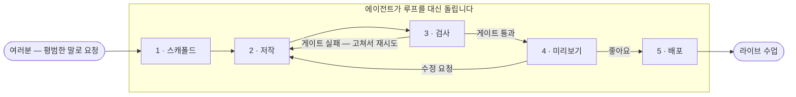
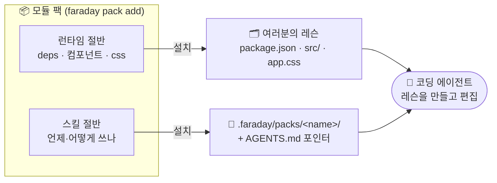

# Faraday Academy

**한국어** · [English](README.en.md)

> **이미 가르치고 있는 수업을, AI 튜터까지 붙은 인터랙티브 교과서로.**
> 
> 코딩 에이전트에게 수업자료만 넣어주면 끝.

<!-- 📸 hero.gif — docs/images/README.md 참고 -->


---

## 지금 바로 시작하기

**준비물:** [Cursor](https://cursor.com) · [Claude Code](https://claude.ai/code) · [Codex](https://openai.com/codex) 중 하나  

에이전트 채팅에 **그대로 붙여넣기**:

```text
아래 스킬을 설치하고 복리를 체감할 수 있는 인터랙티브 수업을 만들어줘.
실행: npx skills add ssota-labs/faraday-academy
```

에이전트가 준비 → 코드 작성 → 검사 → 브라우저 미리보기까지 진행합니다.
끝나면 채팅에서 더 구체적인 요구를 요청하세요.


### 다른 주제 복붙 예시

```text
이진 탐색을 한 단계씩 보여주는 수업을 만들어줘. AI 튜터도 붙여줘.
```

```text
태양계를 3D로 보여주는 수업을 만들어줘. 시간 속도 슬라이더도 넣어줘.
```

```text
확률을 가르치는 골턴 보드를 물리 엔진으로 만들어줘. 공이 쌓여 정규분포가 되게 해줘.
```

더 많은 예시 → [이런 걸 만들 수 있어요](#이런-걸-만들-수-있어요--감을-잡는-예시)

<details>
<summary>에이전트별 설치 (직접 플러그인 쓰는 경우)</summary>

| 에이전트 | 하는 일 |
|---|---|
| **Claude Code** | `/plugin marketplace add ssota-labs/faraday-academy` → `/plugin install faraday@faraday` |
| **Codex** | `codex plugin marketplace add ssota-labs/faraday-academy` |
| **공통 (skills)** | `npx skills add ssota-labs/faraday-academy` |

자세한 내용: [`plugins/claude-code/`](plugins/claude-code/) · [`plugins/codex/`](plugins/codex/)

</details>

<details>
<summary>터미널로 직접 스캐폴드하고 싶다면</summary>

```bash
npx @faraday-academy/cli@latest new my-lesson
cd my-lesson && pnpm dev
```

대부분 경우엔 위 채팅 경로가 더 쉽습니다 — 스킬이 블록·팩·품질 게이트까지 함께 잡습니다.

</details>

---

## Faraday가 하는 일 (한 줄)

말하는 대로 **조작 가능한 수업 앱**(Vite + React)을 만들고, 원하면 **AI 튜터**·3D·퀴즈·커리큘럼까지 붙입니다.
대상: 이미 코딩 에이전트를 쓰는 튜터·조교·교사·강의 저자.

비전·로드맵: [VISION.md](docs/VISION.md) · [GTM.md](docs/GTM.md)

---

## 왜 Faraday인가

코딩 에이전트 덕분에 교육 자료를 *코드로 만드는 일*이 싸졌습니다. 그런데도 대부분은 슬라이드·PDF 같은 **정적 텍스트**에 머물러 있습니다. 같은 개념도 슬라이더·시뮬레이션·퀴즈·3D·옆자리 AI 튜터로 *직접 해보면* 더 잘 남습니다.

문제는 퀄리티입니다. 날것의 에이전트도 “뭔가”는 만들지만, **잘 가르치는** 결과물까지는 시행착오가 깁니다. Faraday는 검증된 **블록·모듈 팩**과, 그걸 잘 조합하도록 가르치는 **스킬**을 미리 넣어 두어 — 의도를 말하면 시행착오를 크게 줄입니다.

노하우도 팩으로 나눌 수 있습니다. 좋은 수업 포맷·교수법이 `faraday pack add` 한 번 거리에 있는 커뮤니티가 목표입니다.

---

## 전체 루프

모든 걸 에이전트에게 말로 시킵니다 — 도구는 에이전트가 대신 실행합니다.
일반적인 수업은 다섯 단계를 거칩니다:

1. **스캐폴드** — 에이전트가 새 수업 앱을 만듭니다 (기본은 2D; 요청에 따라 3D,
   물리, AI 튜터를 붙입니다).
2. **저작** — Faraday 블록과 런타임으로 `src/lesson/lesson.tsx`를 작성합니다.
   가장 창의적인 부분이며, 여러분의 프롬프트가 여기를 좌우합니다.
3. **검사** — 구조 + 무결성 게이트를 돌리고 걸리는 건 고칩니다.
4. **미리보기** — 로컬에서 수업을 띄워 직접 만져보고 수정을 요청할 수 있게
   합니다.
5. **배포** — 요청하면 정적 번들(튜터 수업은 서버 빌드)을 만들어 내보냅니다.



처음부터 끝까지 평범한 말이면 됩니다 — "그래프 더 크게", "퀴즈 추가해줘",
"이제 배포해줘". **저작 → 검사 → 미리보기** 구간은 필요한 만큼 반복됩니다 —
여러분은 그냥 계속 수정을 요청하면 됩니다. 궁금하다면, 아래
[CLI 레퍼런스](#cli-레퍼런스)가 에이전트가 내부적으로 실행하는 명령들을 정리해
둡니다.

---

## 두 개의 영역 (수업 구성 방식)

스캐폴드된 모든 수업에는 두 개의 영역이 있습니다. 어느 쪽이 어느 쪽인지 알아두면
여러분과 에이전트가 헷갈리지 않을 뿐입니다 — 전부 여러분의 코드이고, 여러분(또는
에이전트)이 무엇이든 바꿀 수 있습니다.

| 영역 | 경로 | 설명 |
|---|---|---|
| **저작 영역** | `src/lesson/**` | 여러분의 수업. `src/lesson/lesson.tsx`가 고정 진입점이며 반드시 React 컴포넌트를 `export default` 해야 합니다. 형제 파일은 자유롭게 추가하세요 — 작업이 일어나는 곳입니다. |
| **런타임 영역** | `src/faraday/**` | 생성된 런타임: shadcn UI, 수업 블록, 런타임, 스타일, 월드/튜터 런타임. 에이전트는 보통 이 안을 *고치기*보다 이걸 *가져다 쓰는* 식으로 저작하므로 업그레이드가 깔끔합니다. SHA-256 매니페스트 덕분에 `pnpm check`가 변경 여부를 *알려주는데* — 잠금이 아니라 알림입니다. 이유가 있으면 고쳐도 됩니다. |

`src/main.tsx`, `index.html`, 설정 파일은 앱 셸(shell)이며 거의 건드릴 일이
없습니다. 템플릿은 이미 `@/faraday/*` 별칭(alias)으로 임포트하므로, 스캐폴드
시점에 임포트 경로를 다시 쓸 일이 없습니다.

스캐폴드된 프로젝트는 `AGENTS.md`와 `docs/authoring.md`에 자체 저작 가이드를
담고 있습니다 — 에이전트가 이 파일들을 읽고 블록 API를 익힙니다.

---

## 구성요소 — 하나의 수업은 무엇으로 이루어지나

수업은 한 덩어리가 아닙니다. Faraday는 가르치는 각 부분마다 컴포넌트를 제공하고,
여러분은 수업마다 이를 조합합니다:

| 미리보기 | 구성요소 | 하는 일 | 무엇으로 |
|---|---|---|---|
|  | **📚 커리큘럼 / 월드** | 수업을 선형 교과서로, 또는 잠금 해제 진행이 있는 게임 같은 지도로 엮어 탐험합니다. | `<Course>` · `<CourseHost>` + 월드 팩 |
|  | **🎬 슬라이드 뷰** | 슬라이드 뷰 프레젠테이션 — 화면당 한 아이디어, 이전/다음, 애니메이션. | `<SlideDeck>` · `sim2d` 팩 · `slide-view` 팩 |
|  | **✅ 퀴즈 / 과제** | *가르치는* 확인 — 객관식, 숫자 입력, 스케치 예측, 시뮬레이션에서 클리어하는 미션. | `<Quiz>` · `<NumericAnswer>` · `<Challenge>` · `<SketchPad>` |
|  | **📊 학생 관리** | 수업 또는 커리큘럼 전체의 진도를 기록하고 대시보드로 보여줍니다 (LMS). | `runtime/lms` (기록기 + 대시보드) |
|  | **🤖 AI 튜터** | 오직 수업 내용에서만 답하는, 근거 기반 소크라테스식 채팅. | `tutor` 팩 |

<!-- 📸 component-*.png 썸네일 — docs/images/README.md 참고. 위 깨진 아이콘은 파일을 넣기 전까지의 placeholder 입니다. -->

그 아래에서 각각은 섞어 쓸 수 있는 **모듈**입니다. 자세한 내용은 다음과 같습니다.

## 무엇을 만들 수 있나 (레이어 스택)

Faraday는 Stage 1에서 기능 셋을 **수평적으로** 닫습니다 — 모든 레이어가
오늘 BYOK / 셀프 배포 환경에서 동작합니다. 이후 단계는 마찰을 제거할 뿐(관리형
AI, 멀티테넌시, 결제), 기능을 추가하지 않습니다. ([VISION.md](docs/VISION.md)
§2 참고.)

각 레이어는 하나의 **모듈**입니다 — 에이전트가 조합하는, pin된
`@faraday-academy/*` 패키지(또는 `runtime` 안의 서브모듈). 런타임은 수업 블록
약 24개를 제공하며, 용도별로 묶으면:

| 그룹 | 블록 | 용도 |
|---|---|---|
| **레이아웃 & 캔버스** | `<Lesson>` `<Prose>` `<Stage>` `<Workbench>` `<ControlGroup>` `<SlideDeck>` | 페이지 구성. `<Workbench>`는 살아있는 캔버스 + 떠 있는 컨트롤, `<SlideDeck>`는 화면 단위(태블릿 / 슬라이드쇼) 레이아웃. |
| **실시간 컨트롤** | `<ParamSlider>` `<ParamSwitch>` `<Segmented>` `<Scrubber>` + `useStepper` `<Readout>` `<Chart>` `<Stat>` | 독자가 돌리는 노브와, 거기에 실시간으로 반응하는 숫자 / 그래프. |
| **평가** | `<Quiz>` `<NumericAnswer>` `<Challenge>` `<SketchPad>` | 인식(객관식), 계산(직접 입력), *수행*(시뮬레이션에서 클리어하는 미션), 예측(펜 / Apple Pencil 스케치 vs 정답 공개). |
| **설명** | `<Derivation>` `<TeX>` `<CodeCell>` `<Reveal>` `<Compare>` `<Callout>` | 한 줄씩 유도되는 수식, KaTeX 수학, 실행 가능한 JS 셀, 점진적 공개와 나란히 비교. |

블록 위에 얹히는 것:

- **3D** (`@faraday-academy/three`, `pack add three`) — 절차적(procedural) 헬퍼(`<Body>`,
  `<Planet>`, `<OrbitPath>`, `<Label3D>`), glTF 로더 `<Model>`, 씬마다 `mood`
  (`space`, `cell`, `lab`, `physics`, `abstract`)를 갖춘 `<Scene3D>`(R3F).
  **절차적 우선, 에셋은 폴백.**
- **Physics** (`pack add three --physics`) — `@react-three/rapier`를 통한 Rapier 중력/충돌.
- **Curriculum / world (커리큘럼 / 세계)** (`runtime/world`) — 여러 수업을 묶기:
  선형 교과서용 `<Course>`(챕터 내비게이션, 이전/다음, `#hash`), 또는 **잠금
  해제 진행(unlock progression)**과 교체 가능한 **팩**을 가진 `<CourseHost>`
  — `linearPack`(상태 목록), `map2dPack`(2D 노드 맵), `world3dPack`(3D 오픈월드 /
  RPG). 팩이 곧 세계 전체를 갈아끼우는 이음새입니다.
- **LMS** (`runtime/lms`) — 수업이나 커리큘럼 전체에 붙는 진도 기록기 + 대시보드.
- **Tutor AI** (`@faraday-academy/tutor`, `pack add tutor`) — 콘텐츠 옆에 임베드되는
  **견고하고 근거 기반의** 채팅 에이전트. 아래에서 더 설명합니다.

---

## 이런 걸 만들 수 있어요 — 감을 잡는 예시

"명령어 하나 → 인터랙티브 수업"이 실제로 무엇을 만들어내는지 짧게 둘러봅니다.
각각은 위의 블록과 플래그를 실제로 조합한 것이며, 에이전트가 주제로부터 필요할
때 생성합니다 — 여러분이 손으로 배선할 필요가 없습니다.

- **다익스트라가 최단경로를 찾는 걸 지켜보세요.** 프런티어가 확장되는 그래프를
  한 단계씩 밟아가며 앞뒤로 스크럽하고 — 왜 확정된 노드를 다시 방문하지 않는지
  내장 튜터에게 *물어보세요*. *(단계별 프레임 + `<Scrubber>` + `tutor` 팩)*
- **복리가 불어나는 걸 체감하세요.** 원금, 이율, 복리 주기를 드래그하면 잔액
  곡선과 최종 숫자가 실시간으로 갱신됩니다. "72의 법칙"이 더 이상 외우는 공식이
  아니게 됩니다. *(실시간 노브 + `<Chart>` + `<Stat>`)*
- **케플러 제2법칙이 같은 면적을 쓸어내는 걸 보세요.** 실제 타원 궤도 위의
  행성이 3D에서 태양 근처에서 빨라지고, 이심률을 드래그해도 같은 면적의
  쓸어냄은 그대로 유지됩니다. *(3D, `space` mood — `three` 팩)*
- **골턴 보드에 공 500개를 떨어뜨리세요.** 실제 물리 — 각 공이 못에 튕기며
  당신이 프로그래밍하지 않은 종 모양 곡선으로 쌓입니다. *(Rapier — `three --physics`)*
- **파동에 관한 3부작 강좌를 들으세요.** 횡파 vs 종파, 그다음 슬라이더로 섞는
  간섭, 그다음 정상파 배음 — 챕터 내비게이션, 이전/다음, 딥링크와 함께.
  *(`<Course>`)*
- **수 체계 퀘스트를 플레이하세요.** 2진수 → 16진수 → 2의 보수를 지도처럼
  펼쳐 놓고, 각 노드의 퀴즈를 통과하면 다음이 잠금 해제되며 진도가 추적됩니다.
  *(잠금 해제 월드 + LMS)*

주제를 바꾸면 세계도 그 mood를 따라갑니다: 빛나는 **동물 세포**(`cell`),
깔끔한 실험실 속 **분자**(`lab`), **추상 기하** 곡면(`abstract`). 관통하는
원칙: 독자는 아이디어를 읽는 대신 직접 *해봅니다*.

### 에이전트에게 그대로 붙여넣을 프롬프트

무엇을 만들지 정했다면, 아래처럼 에이전트에게 말하기만 하면 됩니다:

```text
"binary search(이진 탐색)를 가르치는 인터랙티브 수업을 만들어줘.
 정렬된 배열에서 탐색 범위가 좁혀지는 걸 한 단계씩 보여주고,
 근거 기반 튜터도 붙여줘."
```

```text
"태양계를 3D로 보여주는 수업을 만들어줘. 행성들이 궤도를 돌고,
 사용자가 시간 속도를 슬라이더로 조절할 수 있게 해줘."   → pack add three
```

```text
"확률을 가르치는 골턴 보드를 물리 엔진으로 만들어줘.
 공 개수를 바꿀 수 있게 하고, 정규분포가 쌓이는 걸 보여줘."  → pack add three --physics
```

플러그인이 설치돼 있으면, 에이전트가 알아서 올바른 플래그로 스캐폴드하고,
블록을 조합하고, 게이트를 통과시킵니다.

---

## AI 튜터 (`tutor` 팩)

`faraday pack add tutor`는 앱을 Vite + Nitro + Workflow 하이브리드로 바꾸고
`<Tutor>` 컴포넌트를 벤더링합니다. Vercel의 AI SDK 설계를 따르며 Workflow
DevKit **durable agent(견고한 에이전트)**를 구동합니다: 답변이 페이지 새로고침,
네트워크 끊김, 서버리스 타임아웃을 견디고 답변 도중에도 이어서 재개됩니다.

<!-- 📸 tutor-wide.png — docs/images/README.md 참고 -->


```tsx
import { Tutor } from "@/faraday/tutor";

<Tutor
  title="이진 탐색 튜터"
  context={LESSON_TEXT}   // 튜터는 오직 이 내용에서만 답합니다 — 근거 기반, 퀴즈 정답 유출 없음
  greeting="안녕하세요! 이진 탐색에 대해 무엇이든 물어보세요."
/>
```

- **근거 기반(Grounded)**: 튜터는 여러분이 넘긴 `context`에서만 답하고, 범위를
  벗어난 질문은 다시 방향을 잡아주도록 스캐폴드됩니다.
- **소크라테스식(Socratic)**: 답을 쏟아내는 대신 힌트를 주고 되묻습니다 —
  퀴즈나 연습문제 정답을 대놓고 유출하지 않습니다.
- **사고(Thinking) + 캐싱**: 기본 모델은 접을 수 있는 "Thinking" 블록으로 추론
  과정을 스트리밍하고, 결정론적 프롬프트 접두사 덕분에 공급자가 늘어나는 대화를
  암묵적으로 캐시할 수 있습니다. (페르소나, 규칙, 모델은
  `workflows/tutor-agent.ts`에 있으며 — 이 파일은 여러분이 편집하는
  파일입니다.)

**설정**: `cp env.example .env.local` 후 `AI_GATEWAY_API_KEY`를 붙여넣으세요
(Vercel 대시보드 → AI Gateway → API keys). `.env.local`은 git에서 무시되며 —
실제 키를 커밋하지 마세요. Vercel에서는 배포 시 OIDC로 Gateway에 인증하므로
키가 필요 없습니다. 정적(튜터 없는) 수업은 서버 없이 유지됩니다. 전체 가이드는
스캐폴드된 `docs/tutor.md`를 참고하세요.

---

## CLI 레퍼런스

```
faraday new <name> [--no-defaults] [--at <dir>] [--overwrite] [--skip-install] [--json]
faraday check [--dir <lesson>]     레이아웃 + 런타임 pin 검증
faraday pack list | add <name|source> [--physics] | remove <name> | show <name> | validate <name>
faraday pack new <name> [--kind skill|copy|runtime]   새 팩 스캐폴드 (팩 저작자용)
faraday help
```

**능력은 플래그가 아니라 팩입니다** — 그리고 `new`는 **배터리 포함(batteries-included)**:
기본 팩(스킬 + 런타임)을 모두 자동 설치하므로 `three`(`--physics` variant), `tutor`,
`srs`, `exam`, `slide-view`, `sim2d`, `game2d`, `storybook-game2d`, `notes`, `lecture-design`, `audience`가 처음부터 손안에
있습니다 (`faraday pack list`로 라이브 카탈로그 확인). 최소 레슨은 `--no-defaults`,
완성된 레슨에서 불필요한 팩(예: 무거운 `three`/`tutor` 런타임)은 `faraday pack remove
<name>`로 덜어냅니다. `faraday pack add <name|source>`는 서드파티 팩을 설치하거나
제거한 팩을 다시 추가합니다.

| `new` 플래그 | 효과 |
|---|---|
| `--no-defaults` | 자동 설치되는 팩들을 건너뛰고 최소 레슨으로 스캐폴드. |
| `--at <dir>` | `./<name>` 대신 `<dir>`에 스캐폴드. |
| `--overwrite` | 비어 있지 않은 대상에도 쓰기 허용. |
| `--skip-install` | `pnpm install` 건너뛰기 (또는 `FARADAY_SKIP_INSTALL=1` 설정). |
| `--json` | 기계가 읽을 수 있는 결과(제목, 패키지명, 디렉터리, 다음 단계) — 에이전트용. |

종료 코드: `0` 성공 · `1` 수업 검사 실패 · `2` 사용법 오류 · `4` 환경 오류.
`--json`을 주면 `new`가 에이전트가 파싱할 수 있는 구조화된 결과를 출력합니다.

---

## 저장소 구조

```
faraday-academy/                # 저장소 루트 = pnpm 워크스페이스 (apps/* + packages/*)
├─ apps/
│  └─ labs/                     # @faraday-academy/labs — 컴포넌트 + 스킬/팩의 내부 Vite 카탈로그
├─ packages/
│  ├─ cli/                      # @faraday-academy/cli — `faraday` 스캐폴더 (bin + src)
│  │  └─ templates/starter/     #   `faraday new`가 찍어내는 앱 셸 (팩은 빌드 시 번들)
│  ├─ official-packs/           # 카테고리별 모듈 팩: course/ (map2d) · lecture/ (slide-view·srs·notes·exam·storybook-game2d) · runtime/ (three·tutor·game2d) · methodology/ (audience·lecture-design) + pack.schema.json
│  ├─ ui/                       # @faraday-academy/ui — shadcn 프리미티브 + 레슨/플랫폼 CSS
│  ├─ kit/                      # @faraday-academy/kit — 블록, 런타임 호스트, 월드, lms (수업이 pin; ui 재export)
│  ├─ three/                    # @faraday-academy/three — 옵트인 R3F/three.js 3D 블록 (pack add three [--physics])
│  └─ tutor/                    # @faraday-academy/tutor — 옵트인 도킹형 <Tutor> 채팅 위젯 (pack add tutor)
├─ examples/                    # 독립 실행형 데모 (자체 lockfile; Vercel root = examples/<name>)
│  └─ voyage-log/               #   예시 커리큘럼 (three 팩)
├─ plugins/
│  ├─ claude-code/              # Claude Code 플러그인 + 마켓플레이스 (Faraday 설치 & 구동)
│  └─ codex/                    # Codex AGENTS.md + 커스텀 프롬프트
├─ specs/                       # tutor-ai.md, world-seed.md (설계)
├─ docs/                        # VISION · GTM · LAUNCH-STAGE1 · DEMO-IDEATION (전략)
├─ AGENTS.md
└─ README.md
```

> 런타임 + 애드온은 일급 워크스페이스 패키지(`@faraday-academy/*`)이며, 생성된
> 수업이 이를 의존성으로 **pin해서 소비**합니다 — 더 이상 벤더링/SHA 잠금이
> 아닙니다. 수업의 pin은 `faraday upgrade`로 옮기세요. `@faraday-academy/labs`는
> 같은 런타임 소스를 `@/faraday` 별칭으로 미리 봅니다.

## 스캐폴더가 하는 일

starter 복사 → 대상 · `.gitignore` 복원 · `@faraday-academy/kit` pin
기본 팩(스킬 + 런타임) 모두 자동설치(`--no-defaults`로 생략) · `app.css`를 런타임
스타일시트에 연결 · 패키지명 + HTML 제목 주입 · `lessonId` 출처(provenance) 레코드
발급 · `pnpm install`. 불필요한 팩은 `faraday pack remove <name>`로 덜어내고,
`faraday check`/`doctor`가 레이아웃 + 정확한 pin을 검증합니다.

## Faraday 자체 개발하기

```bash
node --test packages/cli/src/*.test.mjs     # CLI 단위 테스트
node packages/cli/bin/faraday.mjs help      # 저장소에서 CLI 실행
```

---

## Faraday 확장하기 — 모듈 팩

> **로드맵 / 아키텍처.** 아래는 Faraday가 자라나는 *방식*입니다. 일부 팩은 이미
> 제공되고(✅), 일부는 예정(🔜)입니다. 완성된 카탈로그가 아니라 방향을 설명합니다.

Faraday는 **두 개의 층에서 동시에** 모듈화되어 있고, 그게 확장성의 핵심입니다:

- **런타임 층** (코드) — 위의 블록, 월드 팩, LMS, 3D, 튜터.
- **스킬 층** (에이전트 지식) — `faraday` 스킬이 국면마다 필요한 레퍼런스
  (`curriculum.md`, `assessment.md`, `worlds.md`, `packs.md` …)를 그때만
  불러옵니다. 그래서 에이전트가 각 모듈을 *언제·어떻게* 쓸지 압니다.

**모듈 팩**은 이 *두 층에 동시에* 얹힙니다: 런타임 모듈 **+** 그걸 구동하는 스킬
지식 **+** 예제 수업 **+** 품질 기준 항목. "부문" 하나를 추가한다는 건 팩 하나를
추가하는 것 — 런타임 코드와 에이전트 지식이 항상 짝으로 함께 갑니다:



| 부문 | 팩 | 상태 | 무엇으로 만드나 |
|---|---|---|---|
| **커리큘럼** | `three` — 3D 씬 / 우주 RPG | ✅ 제공 중 | `@faraday-academy/three` + scaffold 데모 + physics variant |
| **튜터** | `tutor` — 근거 기반 AI 튜터 | ✅ 제공 중 | pin된 위젯 + author-editable durable 서버 |
| **암기** | `srs` — 간격 반복 플래시카드 | ✅ 제공 중 | author-editable `<Flashcards>`(SM-2), 신규 deps 0개 |
| **렉쳐 구성** | `lecture-design` — 교수법 & 교육학 | ✅ 제공 중 · **default** | 스킬-온리 폴더 (5 moves + 5E/CRA/Peer Instruction/Mayer/Merrill) |
| **대상(Audience)** | `audience` — 학습자별 전달 방법론 | ✅ 제공 중 · **default** | 스킬-온리 (CRA / 5E / Peer Instruction / Mayer / Merrill + 레이아웃) |
| **슬라이드 뷰** | `slide-view` — 애니메이션 슬라이드 프레젠테이션 | ✅ 제공 중 | 폴더 스킬 (슬라이드 디자인 → 모션 → 페이싱), `<SlideDeck>` + 모션 조합, deps 0개 |
| **2D 시뮬** | `sim2d` — SVG + GSAP | ✅ 제공 중 | 공식 기반 시뮬레이션; runtime motion 훅 대체 |
| **2D 게임** | `game2d` — PixiJS 스테이지 | ✅ 제공 중 | Pixi v8 + Matter + Howler; `src/lesson/game2d`에 저자 편집 글루 |
| **스토리북 2D** | `storybook-game2d` | ✅ 제공 중 | `game2d` 위 페이지형 동화 셸 (구 `kids` 흡수); CRA + 큰 타깃 |
| **시험** | `exam` — 실전 / 모의고사 | ✅ 제공 중 | 폴더 스킬 (블루프린트 → 문항 → 채점 → 무결성), 평가 블록 조합, deps 0개 |
| **노트** | `notes` — 굿노트식 펜 | ✅ 제공 중 | author-editable `<Notebook>` 잉크 캔버스 (Canvas + PointerEvents, 필압), deps 0개 |

**품질 관리도 팩의 일부입니다.** 모든 팩은
[`quality-bar.md`](plugins/claude-code/skills/faraday/references/quality-bar.md)를
기준으로 만들어지고, `faraday-author` 서브에이전트가 수업을 끝까지 만들어 산출물을
채점할 수 있게 합니다. 지향점은 평가 루프입니다: 에이전트가 프롬프트로 수업을
생성하고, 다른 에이전트들이 루브릭으로 채점하고, 팩은 그 통과율로 게이팅됩니다.

**써보세요.** 네 개 팩이 이미 제공됩니다 — `faraday pack list` 후
`faraday pack add <name> [--physics] [--dir <lesson>]`. 한 명령이 런타임 절반
(deps / 소스 / CSS) **과** 스킬 절반(에이전트가 로드하는 저작 가이드, `AGENTS.md`
에서 가리킴)을 기존 레슨에 한 번에 설치합니다. `faraday new`의
`faraday new`엔 능력 플래그가 없습니다 — 모든 능력은 `faraday pack add`로 추가하는 단일 메커니즘입니다.
전체 포맷 + 설치 위치 + 로드맵: [`specs/module-packs.md`](specs/module-packs.md).

---

## 앞으로의 방향

Faraday는 두 개의 AI 시스템 중 **빌드 타임** 절반입니다: *창작 AI*가 지금
교육 콘텐츠를 저작하고(플러그인이 구동하는 부분), *튜터 AI*가 런타임에 학생을
가르칩니다(tutor 팩이 임베드하는 부분). 플랫폼 단계에서는 관리형 AI(Vercel AI
Gateway), 멀티테넌시(Vercel Platforms), 그리고 제작자↔학생 결제가 추가되어 —
오픈코어 CLI를 3면 마켓플레이스로 바꿉니다. 전체 흐름은
[VISION.md](docs/VISION.md)와 [GTM.md](docs/GTM.md)를 읽어보세요.

---

## 라이센스

Faraday는 **fair-code** 배포 소프트웨어입니다 — 소스는 공개되지만, OSI 승인
오픈소스는 **아닙니다**.

- 이름에 `.ee.`가 포함된 파일과 `ee/` 디렉터리 아래 콘텐츠를 **제외한** 모든
  것은 **Sustainable Use License**([LICENSE.md](LICENSE.md))로 배포됩니다.
  내부 업무 목적이나 비상업적 용도로 셀프호스팅·수정할 수 있고, 비상업적
  목적이라면 무료로 재배포할 수 있습니다.
- **여러분이 생성한 수업은 여러분 것입니다.** CLI가 스캐폴드해 준 lesson
  산출물 — 저작 영역 코드와 빌드된 `dist/` 번들 — 은 예외로 처리됩니다:
  어떤 목적으로든(학생에게 강의 접근권을 **판매**하는 것 포함) 배포·판매할 수
  있으며, 별도 계약이 필요 없습니다. [LICENSE.md](LICENSE.md)의 "Generated
  Lessons" 섹션을 참고하세요.
- **Faraday 자체**(CLI, 런타임, 애드온 패키지)를 제3자 고객 대상의 유료 관리형
  호스팅 서비스(월간·사용량 기반 호스팅 인스턴스 포함)로 제공하려면 별도의
  상업 계약이 필요합니다.
- `.ee.`가 포함된 파일과 `ee/` 디렉터리 아래 콘텐츠는 **Faraday Enterprise
  License**([LICENSE_EE.md](LICENSE_EE.md))로 배포되며 유효한 상업 계약이
  필요합니다.
